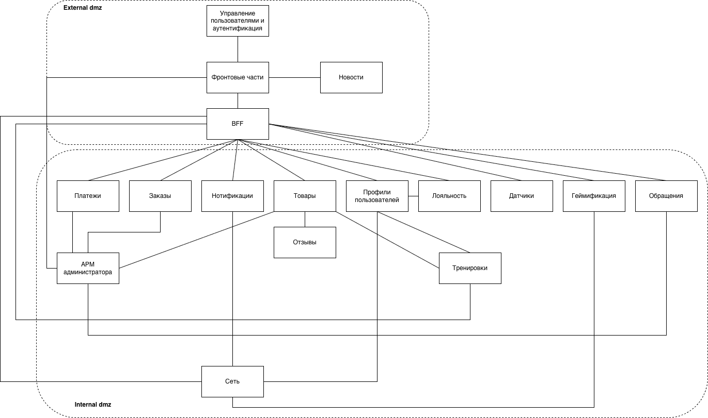

# Описание сервисов
##  Сервисы внешнего сегмента
- UI -  фронтовые части под веб и мобильные версии 
- back-for-front - слой для работы с сервисами внутреннего сегмента, а также для реализации небольшой логики для фронтовых частей. Может быть несколько bff под каждый UI
- manage-user-auth - сервис для управления пользователями и их аутентификацией

##  Сервисы внутреннего сегмента
Каждый сервис имеет собственную базу данных. БД должны быть в кластере и распределены как минимум по 2м разным ЦОД. Для кластеризации можно использовать Patroni, если нет целевой технологии в компании.
Все сервисы установлены на мониторинг. Обычно в компаниях уже используется целевой сервис для мониторинга. Если нет, можно использовать Grafana + Prometheus.
Аналогично с отслеживанием бизнес метрик - необходимо использовать целевой поход. Если такового нет, то можно применить ежедневную репликацию необходимых данных и FineBI для постороения дашбордов и мониторинга метрик.
Для асинхронного взаимодействия можно применить брокер сообщений Kafka, если нет целевой технологии.
- Платежи - сервис для работы с оплатой/платежами(проведение платежей, хранение/отображение информации и др)
- Заказы - сервис для работы с заказами (формирование, отмена, отображение и др)
- Нотификации - сервис для отправки уведомлений
- Товары - сервис для работы с товарами (учет, добавление, удаление и др)
- Отзывы - сервис для работы с отзывами (создание, удаление, модерация и др)
- Лояльность - сервис лояльности (формирования/хранения/расчета скидок и иных программ лояльности)
- Обращения - сервис для работы с обращениями (создание, разбор и др)
- АРМ администратора - набор сервсиов UI, backend, БД, позволяющие внутренним сотрудникам магазина выполнять администрирующие функции (редактирование контента сайта, управление заказами, работа с обращениями и др)
- Датчики - сервис для работы с датчиками (получение, хранение, отображение данных с датчиков и др)
- Профили пользователей  - аргрегирующий сервис для работы с профилями(данными) пользователей
- Геймификация - сервис для реализации функций геймификации
- Новости - сервис для предоставления новостей
- Сеть - сервис для огранизации стетей коммуникации между пользователями 
- Тренировки - сервис для работы с программами тренировок (состав, расписание, редактирование и др)
##  Верхнеуровневая диаграмма
.

