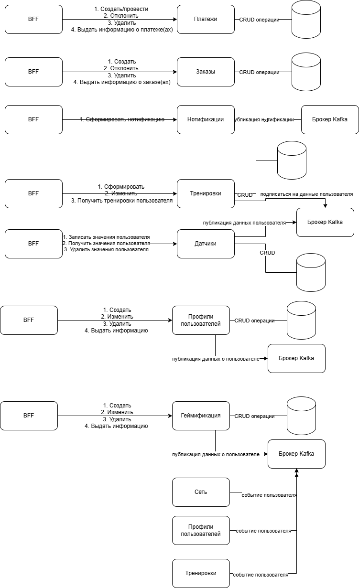

# Функциональное представление
Общая концепция:  
- Каждый сервис имеет собственную базу данных, которая должна быть размещена в кластерных конфигурациях, распределённых минимум по двум разным дата-центрам (ЦОД).  
- Для кластеризации баз данных рекомендуется использовать Patroni, при отсутствии заранее выбранной технологии.  
- Мониторинг и метрики: все сервисы интегрированы с системой мониторинга. В случае отсутствия целевого решения, используется Grafana и Prometheus.  
- Бизнес-метрики: собираются по стандартной процедуре (например, через репликацию данных или другой целевой подход) и визуализируются с помощью устройств типа FineBI или аналогичных.  
- Асинхронное взаимодействие: использование брокера сообщений Kafka (или аналогичного), если предустановленный целевой инструмент отсутствует.  

Перечень сервисов и их функциональные области:

1. Платежи  
   - Обработка платежных транзакций  
   - Хранение информации о платежах  
   - Отображение статусов платежей  
   
2. Заказы  
   - Формирование заказа  
   - Отмена и изменение заказов  
   - Просмотр истории заказов  
   
3. Нотификации (уведомления)  
   - Отправка уведомлений пользователям (по email, push, и др.)  
   - Управление шаблонами уведомлений  
   
4. Товары  
   - Управление каталогом товаров (добавление, редактирование, удаление)  
   - Учёт остатков и статусов товаров  
   
5. Отзывы  
   - Создание, редактирование, удаление отзывов  
   - Модерация отзывов  
   
6. Лояльность  
   - Расчёт и применение скидок  
   - Формирование программ лояльности и бонусных программ  
   
7. Обращения (системы поддержки)  
   - Создание обращений (заявок, жалоб)  
   - Разбор обращений и их статус  
   
8. АРМ администратора  
   - UI и бекенд для внутреннего управления магазином  
   - Редактирование контента, управление заказами и обращениями, аналитика  
   
9. Датчики  
   - Получение данных с физических или виртуальных датчиков  
   - Хранение и визуализация данных датчиков  
   
10. Профили пользователей  
    - Хранение и управление данными профилей  
    - Агрегация и доступ к пользовательской информации  
   
11. Геймификация  
    - Реализация игровых элементов: награды, бонусы, достижения  
    - Интеграция с профилями и системой наград  
   
12. Новости  
    - Публикация и управление новостями  
    - Рассылка или отображение новостных лент  
   
13. Сеть  
    - Организация коммуникаций между пользователями (чат, форумы, соц.сети)  
    - Взаимодействия и обмен сообщениями  
   
14. Тренировки  
    - Создание и управление программами тренировок  
    - Расписание, редактирование и аналитика тренировочного процесса  

Общие требования к инфраструктуре и интеграциям:  
- Каждому сервису — отдельная база данных, кластеризованная и распределённая по минимум двум ЦОДам, с возможностью автоматического восстановления (например, через Patroni).  
- Реализация мониторинга сервисов и метрик с помощью стандартных инструментов (Grafana + Prometheus), а также бизнес-метрик — с использованием целевых решений или ситуативных методов (репликации, BI-систем).  
- Для асинхронной коммуникации рекомендуется Kafka или подобные брокеры сообщений, что обеспечит масштабируемость и отказоустойчивость систем.  
.
