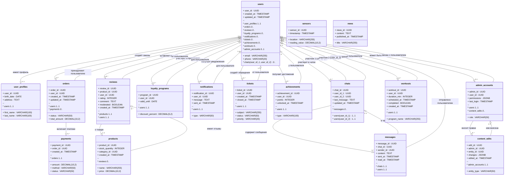

# Информационное представление

```mermaid
classDiagram
  class users {
    + user_id : UUID
    + email : VARCHAR(255)
    + phone : VARCHAR(20)
    + created_at : TIMESTAMP
    + updated_at : TIMESTAMP
    --
    * user_profiles 1..1
    * orders 0..*
    * reviews 0..*
    * loyalty_programs 0..*
    * notifications 0..*
    * tickets 0..*
    * achievements 0..*
    * chats (user_id_1, user_id_2) 0..*
    * workouts 0..*
    * admin_accounts 0..1
  }

  class user_profiles {
    + user_id : UUID 
    + first_name : VARCHAR(100)
    + last_name : VARCHAR(100)
    + birth_date : DATE
    + address : TEXT
    --
    * users 1..1
  }

  class orders {
    + order_id : UUID
    + user_id : UUID
    + status : VARCHAR(50)
    + total_amount : DECIMAL(10,2)
    + created_at : TIMESTAMP
    + updated_at : TIMESTAMP
    --
    * users 1..1
    * payments 0..*
  }

  class payments {
    + payment_id : UUID
    + order_id : UUID
    + amount : DECIMAL(10,2)
    + method : VARCHAR(50)
    + status : VARCHAR(50)
    + created_at : TIMESTAMP
    --
    * orders 1..1
  }

  class products {
    + product_id : UUID 
    + name : VARCHAR(255)
    + price : DECIMAL(10,2)
    + stock_quantity : INTEGER
    + category_id : UUID
    + created_at : TIMESTAMP
    --
    * reviews 0..*
  }

  class reviews {
    + review_id : UUID
    + product_id : UUID
    + user_id : UUID 
    + rating : INTEGER
    + comment : TEXT
    + moderated : BOOLEAN
    + created_at : TIMESTAMP
    --
    * products 1..1
    * users 1..1
  }

  class loyalty_programs {
    + program_id : UUID 
    + user_id : UUID 
    + discount_percent : DECIMAL(5,2)
    + valid_until : DATE
    --
    * users 1..1
  }

  class notifications {
    + notification_id : UUID 
    + user_id : UUID 
    + type : VARCHAR(50)
    + message : TEXT
    + sent_at : TIMESTAMP
    --
    * users 1..1
  }

  class tickets {
    + ticket_id : UUID 
    + user_id : UUID
    + subject : VARCHAR(255)
    + status : VARCHAR(50)
    + priority : VARCHAR(20)
    + created_at : TIMESTAMP
    + closed_at : TIMESTAMP
    --
    * users 1..1
  }

  class sensors {
    + sensor_id : UUID 
    + location : VARCHAR(255)
    + reading_value : DECIMAL(10,2)
    + timestamp : TIMESTAMP
  }

  class achievements {
    + achievement_id : UUID
    + user_id : UUID
    + type : VARCHAR(100)
    + points : INTEGER
    + unlocked_at : TIMESTAMP
    --
    * users 1..1
  }

  class news {
    + news_id : UUID 
    + title : VARCHAR(255)
    + content : TEXT
    + published_at : TIMESTAMP
  }

  class chats {
    + chat_id : UUID 
    + user_id_1 : UUID 
    + user_id_2 : UUID 
    + last_message : TEXT
    + updated_at : TIMESTAMP
    --
    * users (user_id_1) 1..1
    * users (user_id_2) 1..1
    * messages 0..*
  }

  class messages {
    + message_id : UUID 
    + chat_id : UUID 
    + sender_id : UUID 
    + content : TEXT
    + sent_at : TIMESTAMP
    + read_at : TIMESTAMP
    --
    * chats 1..1
    * users 1..1
  }

  class workouts {
    + workout_id : UUID 
    + user_id : UUID 
    + program_name : VARCHAR(255)
    + duration_min : INTEGER
    + scheduled_at : TIMESTAMP
    + completed : BOOLEAN
    + created_at : TIMESTAMP
    --
    * users 1..1
  }

  class admin_accounts {
    + admin_id : UUID 
    + user_id : UUID 
    + role : VARCHAR(50)
    + permissions : JSONB
    + last_login : TIMESTAMP
    --
    * users 1..1
    * content_edits 0..*
  }

  class content_edits {
    + edit_id : UUID 
    + admin_id : UUID 
    + entity_type : VARCHAR(50)
    + entity_id : UUID
    + changes : JSONB
    + edited_at : TIMESTAMP
    --
    * admin_accounts 1..1
  }

  users --|>"1..1" user_profiles : имеет профиль
  users --|>"0..*" orders : создаёт заказы
  users --|>"0..*" reviews : оставляет отзывы
  users --|>"0..*" loyalty_programs : участвует в программах
  users --|>"0..*" notifications : получает уведомления
  users --|>"0..*" tickets : создаёт обращения
  users --|>"0..*" achievements : получает достижения
  users --|>"0..*" chats : участвует в чатах
  users --|>"0..*" workouts : планирует тренировки
  users --|>"0..1" admin_accounts : может быть админом


  orders --|>"0..*" payments : включает платежи
  orders --|> "1..1" users : принадлежит пользователю


  products --|>"0..*" reviews : имеет отзывы


  reviews --|> "1..1" products : о товаре
  reviews --|> "1..1" users : от пользователя


  loyalty_programs --|> "1..1" users : для пользователя


  notifications --|> "1..1" users : для пользователя


  tickets --|> "1..1" users : от пользователя


  achievements --|> "1..1" users : у пользователя


  chats --|> "1..1" users : участник 1 (user_id_1)
  chats --|> "1..1" users : участник 2 (user_id_2)
  chats --|>"0..*" messages : содержит сообщения


  messages --|> "1..1" chats : в чате
  messages --|> "1..1" users : отправлено пользователем


  workouts --|> "1..1" users : у пользователя


  admin_accounts --|> "1..1" users : связан с пользователем
  admin_accounts --|>"0..*" content_edits : вносит правки


  content_edits --|> "1..1" admin_accounts : кем внесена

```
